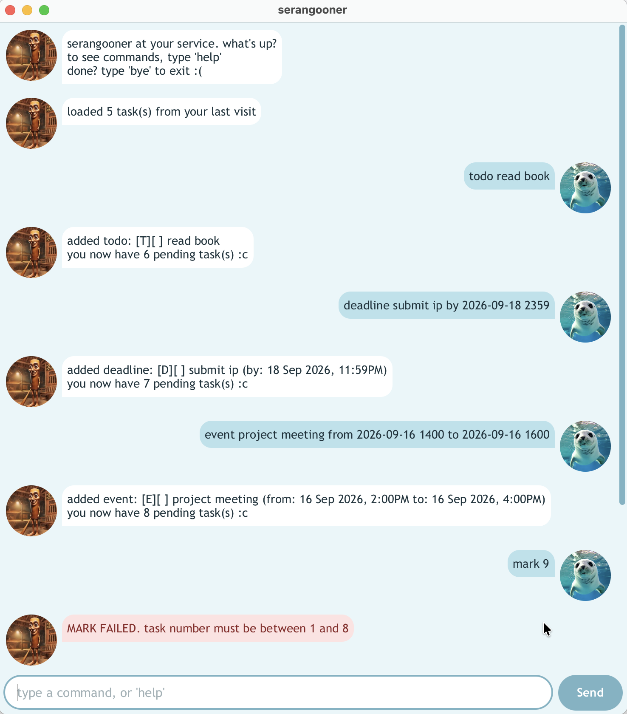

# Serangooner User Guide



Serangooner is a chatbot that keeps track of your tasks. Tell it what you need
to do, whether that is a plain to-do, something due by a deadline, or an event
that runs from one time to another, and it remembers the lot for you. It saves
every change as you go, finds tasks by keyword or by date, and can undo your
last edits when you slip.

Serangooner is chatty, a little cheeky, and happiest when your list is short.

- [Quick start](#quick-start)
- [Features](#features)
  - [Viewing help: `help`](#viewing-help-help)
  - [Adding a todo: `todo`](#adding-a-todo-todo)
  - [Adding a deadline: `deadline`](#adding-a-deadline-deadline)
  - [Adding an event: `event`](#adding-an-event-event)
  - [Listing all tasks: `list`](#listing-all-tasks-list)
  - [Finding tasks by keyword: `find`](#finding-tasks-by-keyword-find)
  - [Viewing tasks by date: `on`](#viewing-tasks-by-date-on)
  - [Marking a task as done: `mark`](#marking-a-task-as-done-mark)
  - [Marking a task as not done: `unmark`](#marking-a-task-as-not-done-unmark)
  - [Deleting a task: `delete`](#deleting-a-task-delete)
  - [Undoing changes: `undo`](#undoing-changes-undo)
  - [Exiting: `bye`](#exiting-bye)
  - [Saving your tasks](#saving-your-tasks)
  - [Editing the data file](#editing-the-data-file)
  - [When a command is refused](#when-a-command-is-refused)
- [FAQ](#faq)
- [Command summary](#command-summary)

## Quick start

1. Make sure you have **Java 25** or later installed. Check by running
   `java -version` in a terminal.
2. Download the latest `serangooner.jar` from the
   [releases page](https://github.com/limenxi07/ip/releases/latest).
3. Put the file in an empty folder. Serangooner saves your tasks in a `data`
   folder inside the folder you start it from.
4. Open a terminal in that folder and run:

   ```
   java -jar serangooner.jar
   ```

   The chat window opens and Serangooner greets you.
5. Type a command in the box at the bottom and press **Enter**, or click
   **Send**. Try these to get started:
   - `todo read book` adds a task.
   - `list` shows every task.
   - `help` lists all the commands.
   - `bye` closes Serangooner.

## Features

> **How to read the command formats**
>
> - Words in angle brackets are values you supply. In `todo <description>`,
>   `<description>` could be `read book`.
> - Parts in square brackets are optional. `on <date> [to <date>]` can be
>   used as `on 2026-09-18` or as `on 2026-09-16 to 2026-09-20`.
> - A `<date>` is written as `yyyy-mm-dd`, optionally followed by a 24-hour
>   time as `hhmm`: `2026-09-18` or `2026-09-18 2359`. Dates that do not exist,
>   such as `2026-02-30`, are refused.
> - A `<number>` is the number a task is shown with in `list`, `find` or `on`.
> - Command words work in any case, so `TODO`, `Todo` and `todo` all work.
> - Spaces around each part are ignored, so `todo   read book  ` adds
>   `read book`.
> - Commands that take nothing, such as `list`, `undo`, `help` and `bye`,
>   refuse any extra words after them.

### Viewing help: `help`

Shows every command with its format, followed by how to write a date.

Format: `help`

```
serangooner commands:
1. todo <description> - add a task without a date or time
2. deadline <description> by <date> - add a task with a deadline
...
12. bye - exit serangooner
dates must look like 2019-10-15 or 2019-10-15 1800
```

### Adding a todo: `todo`

Adds a task that has no date or time.

Format: `todo <description>`

Example: `todo read book`

```
added todo: [T][ ] read book
you now have 1 pending task(s) :c
```

### Adding a deadline: `deadline`

Adds a task that must be done by a certain date, and optionally a time.

Format: `deadline <description> by <date>`

Examples:

- `deadline return book by 2026-09-20`
- `deadline submit ip by 2026-09-18 2359`

```
added deadline: [D][ ] submit ip (by: 18 Sep 2026, 11:59PM)
you now have 3 pending task(s) :c
```

The description may itself contain the word "by": `deadline stand by me by
2026-09-20` adds a deadline named `stand by me`. The last `by` is the one taken
to introduce the date.

### Adding an event: `event`

Adds an event that starts and ends at the given dates, and optionally times.

Format: `event <description> from <date> to <date>`

Examples:

- `event project meeting from 2026-09-16 1400 to 2026-09-16 1600`
- `event recess week from 2026-09-19 to 2026-09-27`

```
added event: [E][ ] project meeting (from: 16 Sep 2026, 2:00PM to: 16 Sep 2026, 4:00PM)
you now have 4 pending task(s) :c
```

- An event cannot end before it starts.
- An event given times cannot end at the very moment it starts.
- The same date at both ends, with no times, is allowed. It describes an event
  taking up that whole day, such as `event open house from 2026-09-26 to
  2026-09-26`.
- As with deadlines, the description may contain "from" and "to". The last
  ones are taken to introduce the dates.

### Listing all tasks: `list`

Shows every task, numbered in the order they were added.

Format: `list`

```
your list
 1. [T][ ] read book
 2. [D][ ] return book (by: 20 Sep 2026)
 3. [D][ ] submit ip (by: 18 Sep 2026, 11:59PM)
 4. [E][ ] project meeting (from: 16 Sep 2026, 2:00PM to: 16 Sep 2026, 4:00PM)
 5. [E][ ] recess week (from: 19 Sep 2026 to: 27 Sep 2026)
```

Each task shows its kind, then whether it is done:

| Tag | Meaning |
| --- | --- |
| `[T]` | A todo |
| `[D]` | A deadline |
| `[E]` | An event |
| `[ ]` | Not done yet |
| `[✓]` | Done |

### Finding tasks by keyword: `find`

Shows the tasks whose description contains the given text.

Format: `find <keyword>`

- The search ignores case, so `find BOOK` finds `read book`.
- Part of a word is enough, so `find boo` also finds `read book`.
- A keyword of several words is searched for as a whole phrase.
- Each task keeps the number it has in the full list, so you can use that
  number straight away with `mark`, `unmark` or `delete`.

Example: `find book`

```
matching tasks:
 1. [T][ ] read book
 2. [D][ ] return book (by: 20 Sep 2026)
```

### Viewing tasks by date: `on`

Shows the deadlines and events that fall on a date, or within a range of dates.

Format: `on <date> [to <date>]`

- A deadline is shown if it falls due within the range.
- An event is shown if any of its days falls within the range, so an event
  that started earlier and is still running is included.
- Todos have no date and are never shown.
- Any time of day given is ignored. Only the dates matter.

Examples:

- `on 2026-09-18`
- `on 2026-09-16 to 2026-09-20`

```
tasks between 16 Sep 2026 and 20 Sep 2026
 2. [D][ ] return book (by: 20 Sep 2026)
 3. [D][ ] submit ip (by: 18 Sep 2026, 11:59PM)
 4. [E][ ] project meeting (from: 16 Sep 2026, 2:00PM to: 16 Sep 2026, 4:00PM)
 5. [E][ ] recess week (from: 19 Sep 2026 to: 27 Sep 2026)
```

### Marking a task as done: `mark`

Marks the task with the given number as done.

Format: `mark <number>`

Example: `mark 2`

```
marked task as done: [D][✓] return book (by: 20 Sep 2026)
```

### Marking a task as not done: `unmark`

Marks the task with the given number as not done yet.

Format: `unmark <number>`

Example: `unmark 2`

```
marked task as incomplete: [D][ ] return book (by: 20 Sep 2026)
```

### Deleting a task: `delete`

Removes the task with the given number. The tasks after it move up by one
number.

Format: `delete <number>`

Example: `delete 1`

```
deleted task: [T][ ] read book
```

### Undoing changes: `undo`

Reverses your most recent change to the list: an add, a mark, an unmark or a
delete. Use it again to keep stepping back, one change at a time.

Format: `undo`

```
undid your last edit
```

- A deleted task comes back at its old number.
- Commands that only show tasks, such as `list`, `find` and `on`, are not
  changes, so there is nothing to undo about them.
- Only changes made since Serangooner was started can be undone. Once there is
  nothing left, Serangooner says `there's nothing to undo >:(`.

### Exiting: `bye`

Says goodbye and closes the window a moment later.

Format: `bye`

```
bye~
```

### Saving your tasks

There is no need to save by hand. Every change is written to
`data/serangooner.txt`, in the folder you started Serangooner from, as soon as
it is made. The next time you start Serangooner from the same folder, it says
how many tasks it loaded.

```
loaded 6 task(s) from your last visit
```

### Editing the data file

Advanced users may edit `data/serangooner.txt` directly, while Serangooner is
closed. The file holds one task per line, with fields separated by a vertical
bar with a space on each side:

```
T | 0 | read book
D | 1 | return book | 2026-09-20
E | 0 | project meeting | 2026-09-16 1400 | 2026-09-16 1600
```

The fields are the kind of task (`T`, `D` or `E`), whether it is done (`1`) or
not (`0`), the description, then any dates, written the same way you type them.

If some lines cannot be read, Serangooner skips them and keeps the rest. It
first copies the original file to `data/serangooner.txt.bak`, so the lines it
skipped are not lost when the list is next saved, and the startup message says
so:

```
loaded 1 task(s) from your last visit; skipped 1 unreadable line(s)
i kept a copy of the original at data/serangooner.txt.bak
```

### When a command is refused

If Serangooner cannot carry out a command, it replies in red, plays a short
sound, and explains what went wrong. Nothing on your list changes. Some of the
things it refuses:

| You typed | Why it is refused |
| --- | --- |
| `blah` | Not a command. Type `help` to see them all. |
| `deadline submit ip` | The `by <date>` part is missing. The reply shows the correct format. |
| `deadline pay rent by 2026-02-30` | 30 February does not exist. |
| `mark 9` | There is no task 9. The reply gives the range of task numbers. |
| `todo READ BOOK` | The same task is already on the list. Case and extra spaces do not make a task different. |
| `event call from 2026-09-16 1400 to 2026-09-16 1400` | The event ends the moment it starts. |
| `list all` | `list` takes nothing after it. |

A task description also cannot contain a vertical bar with a space on each
side, since that is how fields are separated in the data file.

## FAQ

**Q: How do I move my tasks to another computer?**
A: Copy the `data` folder to the folder holding `serangooner.jar` on the other
computer, then start Serangooner from there.

**Q: I started Serangooner and my tasks are gone. What happened?**
A: Serangooner looks for `data/serangooner.txt` in the folder you started it
from. Start it from the folder you used before, and your tasks will be back.

**Q: Can I use Serangooner without the window?**
A: Yes. Run `java -cp serangooner.jar serangooner.Serangooner` to chat in the
terminal instead. It understands the same commands and uses the same data file.

## Command summary

| Command | Format and example |
| --- | --- |
| Help | `help` |
| Add todo | `todo <description>`<br>e.g. `todo read book` |
| Add deadline | `deadline <description> by <date>`<br>e.g. `deadline submit ip by 2026-09-18 2359` |
| Add event | `event <description> from <date> to <date>`<br>e.g. `event recess week from 2026-09-19 to 2026-09-27` |
| List | `list` |
| Find | `find <keyword>`<br>e.g. `find book` |
| View by date | `on <date> [to <date>]`<br>e.g. `on 2026-09-16 to 2026-09-20` |
| Mark | `mark <number>`<br>e.g. `mark 2` |
| Unmark | `unmark <number>`<br>e.g. `unmark 2` |
| Delete | `delete <number>`<br>e.g. `delete 1` |
| Undo | `undo` |
| Exit | `bye` |
